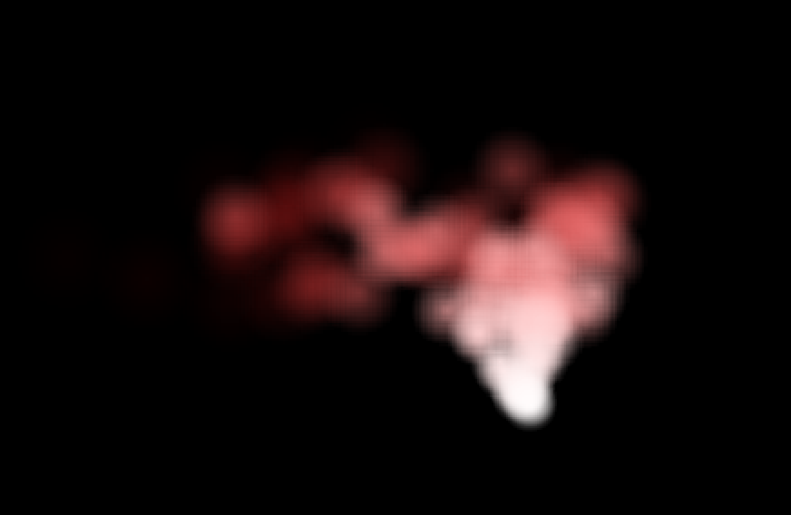
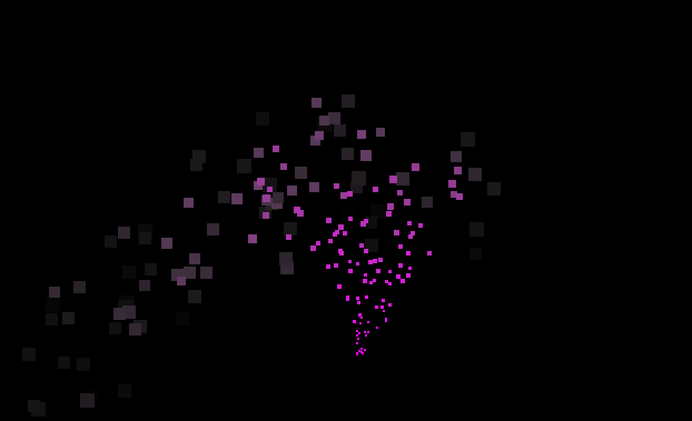
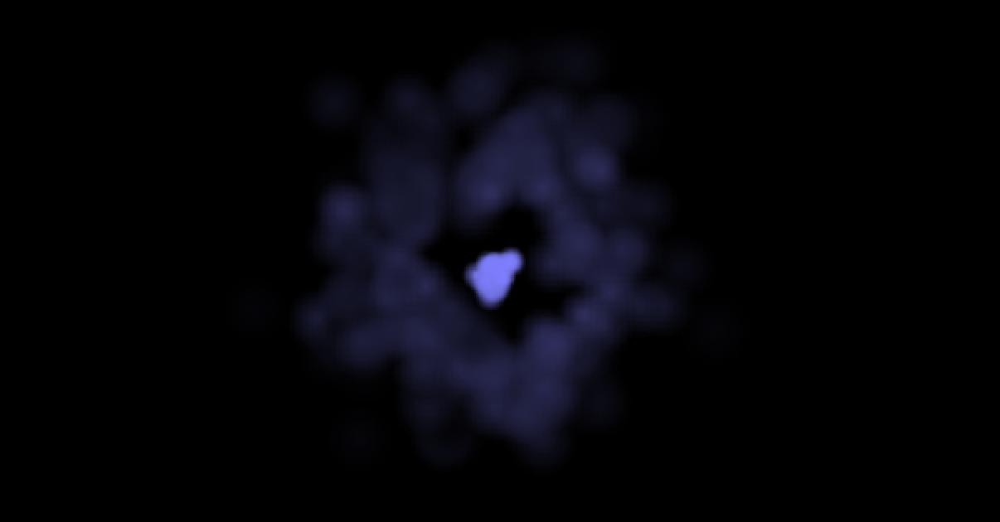

# ParticleFX2D

This is a 2D particle effects API for use with any Ruby graphics API.

> **Caution**
>
> Most of the functionality is  fairly stable and any changes will likely be additive. However portions identified as "preview" are likely to experience API changes.

- [Installation](#installation)
- [Usage](#usage)
  - [Setting up an Emitter](#setting-up-an-emitter)
  - [Using Ruby2D](#using-ruby2d)
    - [Examples](#examples)
  - [Knobs & Dials](#knobs--dials)
    - [Emitter Controls](#emitter-controls)
    - [Particle Controls](#particle-controls)
- [Development](#development)
- [Contributing](#contributing)
- [License](#license)
- [Code of Conduct](#code-of-conduct)

## Installation

Add this line to your application's Gemfile:

```ruby
gem 'particlefx2d'
```

And then execute:

    $ bundle install

Or install it yourself as:

    $ gem install particlefx2d

## Usage

After the gem has been installed, using `ParticleFX2D` involves the following steps:

1. Define an emitter
2. Define a particle renderer factory and renderer (or use the ones included if you're using [Ruby2D](https://www.ruby2d.com/))
3. Call the emitter's `#update` method from your app's animation loop

### Setting up an Emitter

```ruby
require 'particlefx2d'

fx = ParticleFX2D::Emitter.new(
      renderer_factory: <<RENDERER_FACTORY>>,   # particle renderer factory
      quantity: 100,                            # max no. of particles
      emission_rate: 15,                        # emit particles/sec
      particle_config: {
        x: 300, x_range: -1.0..1.0,             # x emission origin
        y: 300, y_range: 0,                     # y emission origin
        start_color: [1, 1, 1, 1],              # start colour array [r, g, b, a]
        end_color: [1, 0, 0, 0],                # end colour
        start_scale: 1, end_scale: 2,           # start and end size scaling
        angle: 90, angle_range: -30.0...30.0,   # emission angle and range
        size: 32, size_range: 0,                # emission size and range
        speed: 40, speed_range: 0..15,          # emission speed and range
        gravity_y: 10, gravity_x: -6,           # gravity in pixels/sec squared
        life_time: 5, life_time_range: 0..2.0   # life of particle
      }
    )
```

### Using Ruby2D

The gem includes a couple of pre-defined particle renderer factories for Ruby2D:
* `ParticleFX2D::Ruby2D::`
  * `ShapeRendererFactory` which can be instantiated by supplying it an object that implements `ShapeRenderer` methods, such as the following pre-defined renderers:
    * `ParticleImage`
      * Use a particle blob via `Ruby2D::Image` as texture to render a particle
    * `ParticleCircle`
      * Use a `Ruby2D::Circle` to render a particle
  * `CanvasRendererFactory` which can be instantiated with a `Ruby2D::Canvas` into which the particles are drawn as squares.
    * The Canvas in Ruby2D is in its early days so consider this factory a preview _with many changes expected_.

#### Examples

| `ShapeRendererFactory`                                                                                                                  | `CanvasRendererFactory`                                                                                     |
| --------------------------------------------------------------------------------------------------------------------------------------- | ----------------------------------------------------------------------------------------------------------- |
| [fx_white_red_smoke](example/ruby2d/fx_white_red_smoke.rb)                     | [fx_square_burst](example/ruby2d/fx_square_burst.rb)  |
| [fx_blue_swirling_smoke](example/ruby2d/fx_blue_swirling_smoke.rb)  |

The above are screenshots from running the various examples included. The first one with the red-white smoke is implemented in the complete example below.

```ruby
require 'ruby2d'
require 'particlefx_ruby2d'

fx = ParticleFX2D::Emitter.new(
      renderer_factory: ParticleFX2D::Ruby2D::ShapeRendererFactory.new(ParticleFX2D::Ruby2D::ParticleImage),
      quantity: 100,                            # max no. of particles
      emission_rate: 15,                        # emit particles/sec
      particle_config: {
        x: 300, x_range: -1.0..1.0,             # x emission origin
        y: 300, y_range: 0,                     # y emission origin
        start_color: [1, 1, 1, 1],              # start colour array [r, g, b, a]
        end_color: [1, 0, 0, 0],                # end colour
        start_scale: 1, end_scale: 2,           # start and end size scaling
        angle: 90, angle_range: -30.0...30.0,   # emission angle and range
        size: 32, size_range: 0,                # emission size and range
        speed: 40, speed_range: 0..15,          # emission speed and range
        gravity_y: 10, gravity_x: -6,           # gravity in pixels/sec squared
        life_time: 5, life_time_range: 0..2.0   # life of particle
      }
    )
update do
  fx.update (1.0 / get(:fps))
end
show

```

### Knobs & Dials

It's all about the _knobs and dials_, every control can be tweaked to get a wide variety of effects. 

#### Emitter Controls

| Emitter Config    | Description                                                      |
| ----------------- | ---------------------------------------------------------------- |
| `quantity`        | Number of total particles in the emitter's pool                  |
| `emission_rate`   | Number of particles to emit per second                           |
| `particle_config` | Configure each particle when it is emitted. See the table below. |

#### Particle Controls

| Particle Config           | Description                                                                                     |
| ------------------------- | ----------------------------------------------------------------------------------------------- |
| `x`                       | Initial x-axis position of emission                                                             |
| `x_range`                 | optional range from which a random value is chosen to add to the initial `x`; default is 0      |
| `y`                       | Initial y-axis position of emission                                                             |
| `y_range`                 | optional range from which a random value is chosen to add to the initial `y`; default is 0      |
| `start_color`             | optional initial colour of the emitted particle. See `Particle` for default                     |
| `end_color`               | optional end colour of the particle by the end of its life. See `Particle` for default          |
| `start_scale`             | optional initial size scale factor of the emitted particle relative to its `size`; default is 1 |
| `end_scale`               | optional end size scale factor of the particle by the end of its life; default is 1             |
| `angle`                   | optional angle at which the particle is emitted, in degrees. See `Particle` for default         |
| `angle_range`             | optional range from which a random value is chosen to add to the `angle`; default is 0          |
| `speed`                   | optional speed at which the particle is emitted, in pixels/s. See `Particle` for default        |
| `speed_range`             | optional range from which a random value is chosen to add to the `speed`; default is 0          |
| `size`                    | optional size of the particle when emitted, in pixels. See `Particle` for default               |
| `size_range`              | optional range from which a random value is chosen to add to the `size`; default is 0           |
| `gravity_x`               | optional linear acceleration in pixels/second squared along the x axis, default is 0            |
| `gravity_y`               | optional linear acceleration in pixels/second squared along the y axis, default is 0            |
| `radial_acceleration`     | optional radial accelation in pixel/seconds squared, default is 0                               |
| `tangential_acceleration` | optional tangential accelation in pixel/seconds squared, default is 0                           |
| `life_time`               | of each particle in seconds. See `Particle` for default                                         |
| `life_time_range`         | optional range from which a random value is chosen to add to the `life_time`; default is 0      |

## Development

After checking out the repo, run `bin/setup` to install dependencies. Then, run `rake spec` to run the tests. You can also run `bin/console` for an interactive prompt that will allow you to experiment.

To install this gem onto your local machine, run `bundle exec rake install`. To release a new version, update the version number in `version.rb`, and then run `bundle exec rake release`, which will create a git tag for the version, push git commits and the created tag, and push the `.gem` file to [rubygems.org](https://rubygems.org).

## Contributing

Bug reports and sugestions are welcome. Otherwise, at this time, this project is closed for code changes and pull requests. I appreciate your understanding.

This project is intended to be a safe, welcoming space for collaboration, and contributors are expected to adhere to the [code of conduct](https://github.com/nogginly/particlefx2d/blob/main/CODE_OF_CONDUCT.md).

## License

The gem is available as open source under the terms of the [MIT License](https://opensource.org/licenses/MIT).

## Code of Conduct

Everyone interacting in the `ParticleFX2D` project's codebases, issue trackers, chat rooms and mailing lists is expected to follow the [code of conduct](https://github.com/nogginly/particlefx2d/blob/main/CODE_OF_CONDUCT.md).
